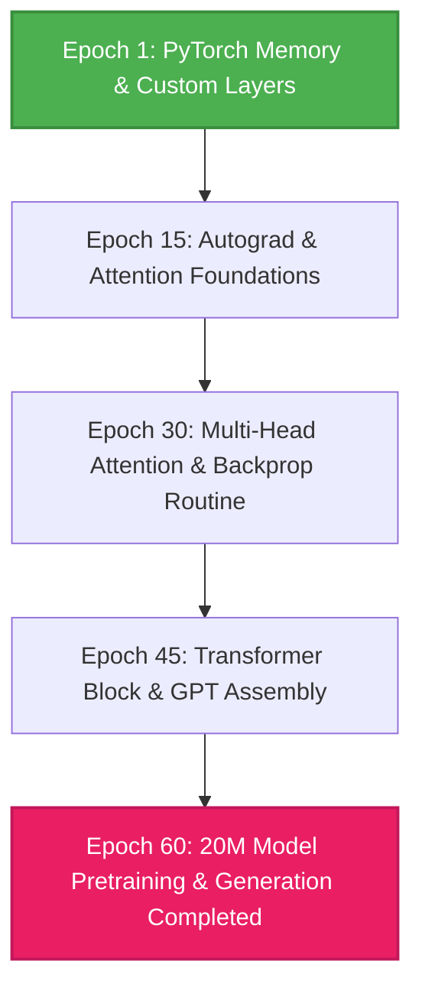

# LLM Architecture Roadmap: From Zero to Model Implementation

> [!IMPORTANT]
> **Disclaimer & Purpose**: This roadmap was custom-built for a personal learning journey in constructing decoder-only Transformers from scratch in PyTorch. It is open-sourced here in case it serves as a useful template, reference, or roadmap for your own learning journey. It is not prescriptive—feel free to adapt it to your pace, schedule, and goals!
> 
> **Note on "Epochs"**: An **Epoch** in this roadmap represents a single milestone unit of progress. One Epoch can be **1 day, 2 days, or whatever pace fits your schedule and familiarity with PyTorch**. Consistency matters far more than speed.

 

---

 

## Progression Overview

 

---

 

## PHASE 1: PYTORCH FOUNDATIONS & CUSTOM LAYERS (Epochs 1 – 15)

 

### Epochs 1 – 5: Tensor Memory, Strides & Custom Modules

- [ ] **Epoch 1 — Tensor Storage & Contiguity**  
  *Task*: Inspect `tensor.storage()`, `tensor.stride()`, and `tensor.is_contiguous()`. Trigger a `RuntimeError` by calling `.view()` on a transposed tensor.

 

- [ ] **Epoch 2 — Strided Reshapes**  
  *Task*: Write a function that reshapes a $(2,3,4)$ tensor to $(2,4,3)$ using `torch.as_strided`.

 

- [ ] **Epoch 3 — Custom Embedding Layer**  
  *Task*: Implement a custom `MyEmbedding` class using raw matrix indexing. Compare against `nn.Embedding`.

 

- [ ] **Epoch 4 — Custom Linear Layer**  
  *Task*: Implement a `MyLinear` class with Kaiming initialization and forward computation via `@`.

 

- [ ] **Epoch 5 — Custom MLP Forward**  
  *Task*: Build a 2-layer MLP using custom `MyLinear` classes and run a clean forward pass.

 
 

### Epochs 6 – 10: Autograd Graphs & Custom Optimizers

- [ ] **Epoch 6 — Computational Graph & Gradient Tracking**  
  *Task*: Track gradients for $y = x^3 + 2x$, use `retain_graph=True`, and inspect `.grad` buffers.

 

- [ ] **Epoch 7 — Graph Detachment**  
  *Task*: Detach a tensor with `.detach()` and verify that autograd stops gradient flow along that path.

 

- [ ] **Epoch 8 — Custom SGD Optimizer**  
  *Task*: Build a custom `SGD` optimizer class updating weights via $\theta \leftarrow \theta - \eta \cdot \nabla \theta$.

 

- [ ] **Epoch 9 — Numerical Jacobian Verification**  
  *Task*: Compute numerical vs. analytical Jacobians for linear transformations using `torch.autograd.functional.jacobian`.

 

- [ ] **Epoch 10 — Custom Autograd Function**  
  *Task*: Write a custom `torch.autograd.Function` fusing `Linear + ReLU` to save intermediate activations for backward passes.

 
 

### Epochs 11 – 15: Attention Math & Causal Masking

- [ ] **Epoch 11 — Attention Math & Shape Tracing**  
  *Task*: Trace shapes on paper: $(B, T, D) \to Q K^T \to (B, T, T) \to \text{softmax} \to \times V \to (B, T, D)$. Implement scaled dot-product attention formula:
  $$\text{Attention}(Q, K, V) = \text{softmax}\left(\frac{Q K^T}{\sqrt{d_k}}\right) V$$

 

- [ ] **Epoch 12 — Causal Masking**  
  *Task*: Create a lower triangular boolean mask (`torch.tril`) and mask upper triangular values with $-\infty$.

 

- [ ] **Epoch 13 — Single-Head Causal Attention**  
  *Task*: Write a forward pass for a single-head causal attention layer and assert input/output shapes.

 

- [ ] **Epoch 14 — FLOP Count & Complexity**  
  *Task*: Derive the FLOP count for attention at context length $T$ to understand why computational complexity is $\mathcal{O}(T^2)$.

 

- [ ] **Epoch 15 — Softmax Stability & Backprop Practice #1**  
  *Task*: Implement numerically stable softmax ($\max(z)$ subtraction). **Backprop Practice**: Derive the Vector-Jacobian Product (VJP) of softmax on paper and compare against analytical gradients.

 

---

 

## PHASE 2: MULTI-HEAD ATTENTION & TRANSFORMER SKELETON (Epochs 16 – 30)

 

### Epochs 16 – 20: Multi-Head Attention Mechanics

- [ ] **Epoch 16 — Head Splitting & Transpositions**  
  *Task*: Reshape tensor $(B, T, D) \to (B, H, T, D/H)$ using `.view()` and `.transpose()`.

 

- [ ] **Epoch 17 — Head Merging & Contiguity**  
  *Task*: Merge attention heads $(B, H, T, D/H) \to (B, T, D)$ using `.transpose()` and `.contiguous().view()`.

 

- [ ] **Epoch 18 — Full Multi-Head Attention Assembly**  
  *Task*: Assemble `MultiHeadAttention` with linear projection layers $W_Q, W_K, W_V, W_O$ and residual dropout.

 

- [ ] **Epoch 19 — Dimension Validation & Testing**  
  *Task*: Write unit tests comparing output shapes and numerical equivalence against `nn.MultiheadAttention`.

 

- [ ] **Epoch 20 — Backprop Practice #2: Multi-Head Attention Gradients**  
  *Task*: Derive VJPs for $W_Q, W_K, W_V, W_O$ projection layers on paper and code manual gradient checks.

 
 

### Epochs 21 – 25: Embeddings & Feed-Forward MLP

- [ ] **Epoch 21 — Token Embeddings Class**  
  *Task*: Implement a `TokenEmbedding` class mapping token vocabulary indices to hidden dimension $D$.

 

- [ ] **Epoch 22 — Positional Embeddings Class**  
  *Task*: Implement a `PositionalEmbedding` class managing a learned positional coordinate table $(T, D)$.

 

- [ ] **Epoch 23 — Summation Fusion**  
  *Task*: Merge token and positional representations via addition ($x = \text{tok} + \text{pos}$) and verify tensor shapes.

 

- [ ] **Epoch 24 — Feed-Forward Network (`MyMLP`)**  
  *Task*: Build a `FeedForward` module: Linear ($D \to 4D$) $\to$ GELU $\to$ Linear ($4D \to D$) $\to$ Dropout.

 

- [ ] **Epoch 25 — Pre-LayerNorm Transformer Block**  
  *Task*: Assemble a single `TransformerBlock` using Pre-LN design:
  $$x \leftarrow x + \text{Attn}(\text{LN}_1(x)), \quad x \leftarrow x + \text{MLP}(\text{LN}_2(x))$$

 
 

### Epochs 26 – 30: Block Stacking & Top-Level GPT Model

- [ ] **Epoch 26 — Block Stacking with `ModuleList`**  
  *Task*: Stack multiple `TransformerBlock` layers using `nn.ModuleList`.

 

- [ ] **Epoch 27 — LM Head & Vocabulary Projection**  
  *Task*: Add final `LayerNorm` and linear output projection head mapping from $D \to \text{vocab\_size}$.

 

- [ ] **Epoch 28 — Full `GPT` Class Assembly**  
  *Task*: Combine token embeddings, positional embeddings, transformer block stack, and LM head into a unified `GPT` class.

 

- [ ] **Epoch 29 — Weight Initialization Routine**  
  *Task*: Write custom recursive initialization setting linear weights standard deviation $\sigma = 0.02$.

 

- [ ] **Epoch 30 — Backprop Practice #3: Residual Connections & Loss Check**  
  *Task*: Pass dummy input tensor $(B=4, T=64)$ through `GPT`. Verify initial loss equals $-\ln(1/\text{vocab\_size})$. **Backprop Practice**: Derive gradient flow through residual skip connections ($x + \text{Attn}(x)$) to prove why Pre-LN stabilizes gradient flow compared to Post-LN.

 

---

 

## PHASE 3: TOKENIZATION, DATA PIPELINE & TRAINING (Epochs 31 – 45)

 

### Epochs 31 – 35: Dataset Curation & Tokenization

- [ ] **Epoch 31 — Dataset Preparation**  
  *Task*: Collect and clean raw text corpus for training.

 

- [ ] **Epoch 32 — Subword BPE Tokenizer Training**  
  *Task*: Train a BPE subword tokenizer using `tiktoken` or `sentencepiece`.

 

- [ ] **Epoch 33 — Tokenizer Encoding & Speed Validation**  
  *Task*: Validate tokenizer compression ratios and save vocabulary files.

 

- [ ] **Epoch 34 — BPE Sequence Dataset**  
  *Task*: Write a `TextDataset` yielding input token IDs and target IDs shifted by 1.

 

- [ ] **Epoch 35 — Memory-Mapped DataLoader (`np.memmap`)**  
  *Task*: Build a memory-mapped data loader for zero-copy binary reading from disk.

 
 

### Epochs 36 – 40: Canary Run & 20M Parameter Config

- [ ] **Epoch 36 — 1M Parameter Canary Model Run**  
  *Task*: Train a small 1M canary model for 500 steps to verify that loss drops smoothly.

 

- [ ] **Epoch 37 — 20M Parameter Model Allocation**  
  *Task*: Configure 20M parameter scale (`seq_len=128`, `num_dims=256`, `num_heads=4`, `num_layers=6`).

 

- [ ] **Epoch 38 — Gradient Clipping & Checkpointing**  
  *Task*: Add `clip_grad_norm_(model.parameters(), 1.0)` and model checkpoint saving routines (`checkpoint.pt`).

 

- [ ] **Epoch 39 — Mixed Precision (`bfloat16`) & AdamW**  
  *Task*: Integrate `torch.bfloat16` mixed precision and configure AdamW optimizer.

 

- [ ] **Epoch 40 — Backprop Practice #4: Overfitting & Optimizer Gradients**  
  *Task*: Overfit a single batch for 100 steps until loss approaches zero. **Backprop Practice**: Manually compute AdamW momentum and gradient updates in NumPy.

 
 

### Epochs 41 – 45: Sampling, Generation & Pipeline Lock

- [ ] **Epoch 41 — Autoregressive Generation Loop**  
  *Task*: Write text generation logic using prompt token encoding and iterative next-token prediction (`generate.py`).

 

- [ ] **Epoch 42 — Temperature & Top-K Sampling**  
  *Task*: Implement temperature scaling and top-K filtering (`top_k=40`, `temperature=0.8`) with multinomial sampling.

 

- [ ] **Epoch 43 — Context Window Sliding Crop**  
  *Task*: Implement context window cropping to handle prompts exceeding maximum sequence length.

 

- [ ] **Epoch 44 — Full Pipeline Integration Test**  
  *Task*: Test end-to-end execution: `python prepare.py` $\to$ `python train.py` $\to$ `python generate.py`.

 

- [ ] **Epoch 45 — Baseline Validation & Milestone Check**  
  *Task*: Audit loss curves, verify weight saving/loading, and lock baseline pipeline code.

 

---

 

## PHASE 4: MODEL TRAINING, REFINEMENT & COMPLETION (Epochs 46 – 60)

 

### Epochs 46 – 50: Full Model Pretraining Launch

- [ ] **Epoch 46 — Pretraining Run Launch**  
  *Task*: Launch full pretraining run of the 20M model on your corpus.

 

- [ ] **Epoch 47 — Loss Tracking & Evaluation Loop**  
  *Task*: Track train vs. validation loss at regular evaluation intervals.

 

- [ ] **Epoch 48 — Hyperparameter Tuning**  
  *Task*: Adjust learning rate warmup, weight decay, and batch sizes based on loss convergence.

 

- [ ] **Epoch 49 — Model Checkpointing & Monitoring**  
  *Task*: Save periodic state checkpoints (`checkpoint.pt`) and monitor training stability.

 

- [ ] **Epoch 50 — Backprop Practice #5: LayerNorm Backward Derivation**  
  *Task*: Practice deriving LayerNorm mean/variance scale factor backprop steps by hand.

 
 

### Epochs 51 – 55: Generation Quality & Sampling Refinement

- [ ] **Epoch 51 — Generation Output Auditing**  
  *Task*: Run test prompts through `generate.py` and analyze token output distribution.

 

- [ ] **Epoch 52 — Perplexity Calculation**  
  *Task*: Calculate validation perplexity ($e^{\text{loss}}$) across dataset splits.

 

- [ ] **Epoch 53 — Code Refactoring & Modular Structure**  
  *Task*: Clean up root directory code into modular files (`model.py`, `train.py`, `dataset.py`, `prepare.py`, `generate.py`).

 

- [ ] **Epoch 54 — Unit Testing & Assertions**  
  *Task*: Add tensor shape assertions and input validation across model components.

 

- [ ] **Epoch 55 — Documentation & Comments Clean-Up**  
  *Task*: Ensure main production files remain clean and uncluttered.

 
 

### Epochs 56 – 60: Final Milestone Completion

- [ ] **Epoch 56 — Final Pretraining Evaluation**  
  *Task*: Run final validation loss checks and confirm stable model convergence.

 

- [ ] **Epoch 57 — Model Checkpoint Locking**  
  *Task*: Lock the trained model weight checkpoint (`checkpoint.pt`).

 

- [ ] **Epoch 58 — Interactive Session Verification**  
  *Task*: Run interactive generation sessions via `generate.py` to verify output generation.

 

- [ ] **Epoch 59 — Technical Architecture Documentation Sync**  
  *Task*: Update [`ARCHITECTURE.md`](file:///home/harsha/Projects/Astra/ARCHITECTURE.md) and [`README.md`](file:///home/harsha/Projects/Astra/README.md) to reflect completed pipeline specifications.

 

- [ ] **Epoch 60 — MODEL IMPLEMENTATION COMPLETED**  
  *Task*: Execute `python generate.py` on your final trained checkpoint. **Baseline 20M Model Implementation Complete!**

 

---

 

## The Final Outcome

By completing Epoch 60, you have built a complete decoder-only GPT Transformer from scratch in PyTorch—from raw tensor math and custom autograd principles to dataset tokenization, training loops, and autoregressive generation.
